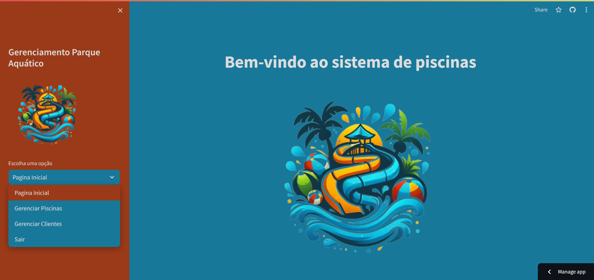

# Sistema Parque Aquático em Python

<table>
  <tr>
    <td valign="top">
      <figure>
        
      </figure>
    </td>
    <td valign="top">

Esta pasta contém o sistema do Parque Aquático em Python utilizando a biblioteca [streamlit](https://www.streamlit.io/) para criar a interface gráfica. O sistema permite o gerenciamento das piscinas e dos clientes do parque aquático. Caso você queira acessar o sistema, clique [aqui](https://sistemaparqueaquatico.streamlit.app/) ou siga as instruções abaixo para executar o sistema localmente.

Aqui estão as funcionalidades disponíveis:
    </td>
  </tr>
</table>




- **Menu lateral**: O menu lateral contém as opções disponíveis no sistema. As opções são:
    - `Menu Inicial`: Página inicial do sistema;
    - `Gerenciar Clientes`: Permite gerenciar os clientes do parque aquático;
    - `Gerenciar Piscinas`: Permite gerenciar as piscinas do parque aquático.


- **Gerenciar Clientes**:
É possível fazer o gerenciamento dos clientes do parque aquático. Para isso, você seleciona a opção "Gerenciar Clientes" no menu lateral. As opções disponíveis são:

    - `Adicionar cliente`: Adiciona um novo cliente ao parque aquático;
    - `Remover cliente`: Remove um cliente do parque aquático;
    - `Editar informações do cliente`: Edita as informações de um cliente;
    - `Buscar cliente por nome`: Busca um cliente pelo nome;
    - `Listar clientes`: Lista os clientes do parque aquático.


- **Gerenciar Piscinas**: É possivel fazer o gerenciamento das piscinas do parque aquático. Para isso, você seleciona a opção "Gerenciar Piscinas" no menu lateral. As opções disponíveis são:
    
    - `Adicionar piscina`: Adiciona uma nova piscina ao parque aquático;
    - `Remover piscina`: Remove uma piscina do parque aquático;
    - `Listar piscinas`: Lista as piscinas do parque aquático e permite adicionar e remover banhistas de cada piscina.
    - `Adicionar banhista`: Adiciona um banhista a uma piscina;
    - `Remover banhista`: Remove um banhista de uma piscina.


## 1. Estrutura de pastas
```
    📁
    │
    ├── linguagem_python
    │   ├── root
    │   │   ├── .streamlit
    │   │   │   ├── config.toml
    │   │   ├── cliente
    │   │   │   ├── cliente.py
    │   │   │   ├── cliente.txt
    │   │   ├── piscina
    │   │   │   ├── piscina.py
    │   │   │   ├── piscina.txt
    │   │   ├── utils
    │   │   │   ├── cliente_functions.py
    │   │   │   ├── piscina_functions.py
    │   │   │   ├── utils.py
    │   │   │   ├── validations.py
    │   │   ├── logo.png
    │   │   ├── main.py
    │   │   ├── requirements.txt
    │   │   └── tela_inicial.png
    │   └── README.md
    └── ...
```

- ```streamlit```: é uma biblioteca que permite criar interfaces gráficas para aplicações em Python. O arquivo `config.toml` contém as configurações do streamlit.
- ```cliente```: contém o arquivo `cliente.py` que possui a classe Cliente e o arquivo `cliente.txt` que armazena os dados dos clientes.
- ```piscina```: contém o arquivo `piscina.py` que possui a classe Piscina e o arquivo `piscina.txt` que armazena os dados das piscinas.
- ```utils```: contém os arquivos `cliente_functions.py`, `piscina_functions.py`, `utils.py` e `validations.py` que possuem funções auxiliares para o sistema.
- ```logo.png```: é a imagem do logo do parque aquático.
- ```main.py```: é o arquivo principal do sistema.
- ```requirements.txt```: contém as bibliotecas necessárias para executar o sistema.


## 2. Pré-requisitos


Para executar o sistema, é necessário possui o Python instalado na máquina. Caso não tenha, você pode baixar o Python [aqui](https://www.python.org/downloads/).


## 3. Requisitos

Com o Python instalado, você pode instalar as bibliotecas necessárias para executar o sistema. Para isso, execute o comando abaixo:

- Para não ter problemas com as dependências, é recomendado criar um ambiente virtual. Para isso, execute o comando abaixo:

```bash
python -m venv venv
```


- Depois, abra o terminal e navegue até a pasta do projeto:

```bash
cd linguagem_python/parque_aquatico
```

- Após isso, execute o comando abaixo para instalar as bibliotecas necessárias:

```bash
pip install -r requirements.txt
```

## 4. Executando o sistema

Com todos os requisitos instalados, você pode executar o sistema. Para isso, execute o comando abaixo:

- Entre na pasta do projeto:

```bash
cd linguagem_python/parque_aquatico
```

- Depois, execute o comando abaixo:

```bash
streamlit run main.py
```